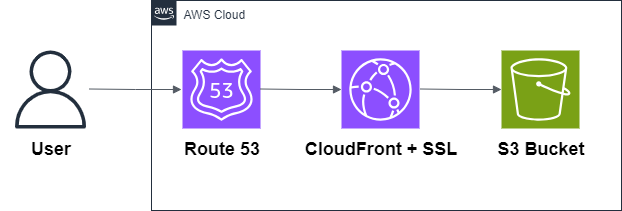
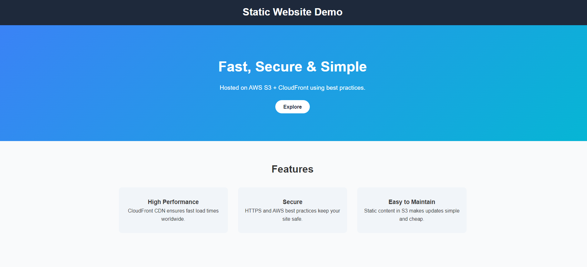
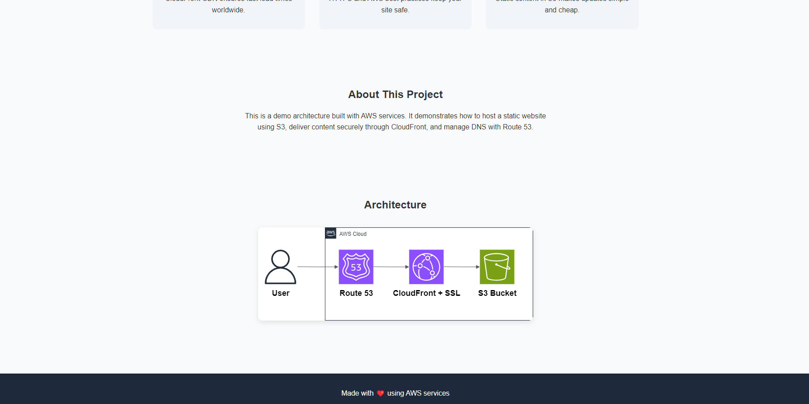

## 🧭 Repository Context

This repository is part of a modularization effort to separate each of the **8 most common AWS architectures** into independent projects.  
The code and resources here were **extracted from a general repository** that originally contained all 8 architectures, to improve clarity, maintainability, and reuse.

🔗 [Original Repository – AWS Architectures Collection](https://github.com/hongzz0618/aws-architecture-collection)

---

## 🌐 Static Website Hosting on AWS

This project shows how to host a fast and secure **static website** using AWS services.  
It uses **Amazon S3** to store the site and **CloudFront** to deliver it globally with HTTPS.

---

## 📐 Architecture

- **S3** → Stores website files (HTML, CSS, JS, images).
- **CloudFront** → Speeds up delivery and adds HTTPS.
- **ACM** → Provides SSL certificate for secure access.
- **Route 53** → Optional, for custom domain setup.

---

## ✅ Why This Pattern?

| Feature         | Benefit                                      |
|-----------------|----------------------------------------------|
| **Simple**       | Easy to set up and manage                   |
| **Low cost**     | Pay only for storage and traffic            |
| **Secure**       | HTTPS with managed certificates             |
| **Fast**         | Global delivery via CDN                     |

---

## 🌍 Real-World Use Cases
- Personal portfolios
- Company landing pages
- Marketing microsites
- Documentation sites

---

## 📦 What’s Inside
- Architecture diagram
- Terraform code for S3, CloudFront, ACM, and Route 53
- Example static website with logo and assets
- Deployment scripts
---

## 🖼️ Demo Screenshots

Here are a couple of screenshots of the deployed site:

  


---

## 🚀 Deployment Guide

```bash
# 1. Configure Terraform variables
# Edit terraform.tfvars with your project details
# project_name   = "YOUR_PROJECT_NAME"
# domain_name    = "YOUR_DOMAIN_NAME"
# hosted_zone_id = "YOUR_HOSTED_ZONE_ID"

# 2. Deploy the infrastructure
cd scripts
./deploy.sh

# 3. Verify your website

# 4. Destroy the infrastructure (optional)
cd scripts
./destroy.sh
```
